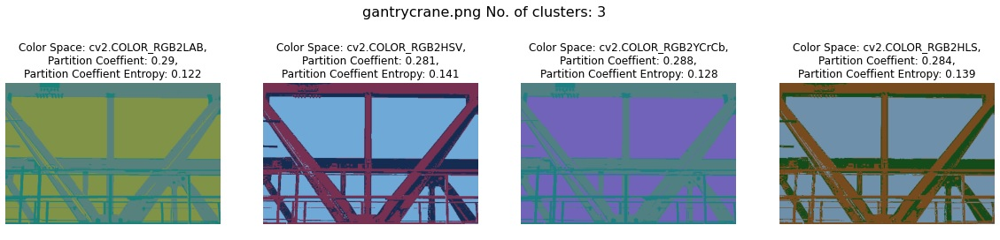
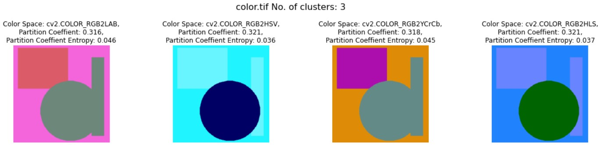
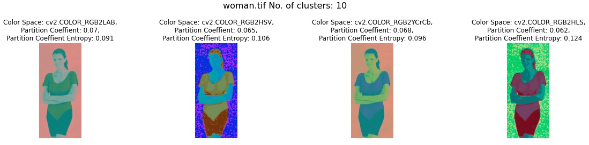

# – Image Segmentation: Clustering

## **Introduction**
The goal of this tutorial is to investigate the usefulness of two clustering-based methods namely, Fuzzy C-mean (FCM) and Expectation-Maximization (EM) algorithms.

## **1- FCM**
### **1.1 Functions Summary**
| Function   | Description |
|----------|:-------------:|
| run_app | Main function that runs the Algorithm|
| image_type |  Function that takes user input to choose which type of image that user wants to do segmentation (Grayscale or RGB) |
| read_image | Function that takes user input to choose which image that user wants to do segmentation (1-gantrycrane.png, 2-coins.png, 3-color.tif, 4-woman.tif)|
| change_color_space |  Function that convert RGB image into different Color Spaces |
| reshape_img |    Function that reshapes the image to convert each pixel to an instance of a data set   |
| create_model | Function that build the Fuzzy C-Means Model and fit the data to model |
| pixel_quantization  | Function to do clustering by predicting the clustered image by using trained fcm model  |
| show_colorspace_images | Function to plot ColorSpace (not RGB) Images |
| show_rgb_or_grayscale_images | Function to plot Gray Scale or RGB Images |
| segmentation_results | Function that generates segmentation results as segmented image array, Partition, and Partition Entropy Coefficients |

### **1.2 Different Color Spaces**
We used different Color Spaces to compare between RGB images and other Color Spaces images as L*A*B, HSV, HLS, YCrCb.

### **1.3 Algorithm Results & Discussion**
We chosed two metrics to evaluate the Clustering Results Partition Coefficient (PC) which is defined on the range from 0 to 1, with 1 being best. It is a metric which tells us how cleanly our data is described by a certain model. Also, Partition Entropy Coefficient (PEC) which is more sensitive to small changes when approaching a hard partition, and unlike (PC) the minimum value imply a good partition in the meaning of a more crisp partition.

#### **1.3.1 Colored Image**
> For All images 8, 10 clusters got the best resuls.

> but to avoid the overfitting problem and there is no much difference between 8, 10 clusters. so, we chose **8 clusters** as highest number of clusters and it got the best results.

> Except for **colors.png** image the best number of clusters are 3 because there is only 3 colors.

#### **gantrycrane.png**
|  | RGB |  LAB | HSV | HLS |YCrCb|
|-------------:|:-------------:|:-------------:| :-------------:| :-------------:| :-------------:|
| Number of clusters = 2 | PC= 0.458, PEC= 0.11 |  PC= 0.447, PEC= 0.134 | PC= 0.442, PEC= 0.144| PC= 0.436, PEC= 0.159| PC= 0.451, PEC= 0.126|
| Number of clusters = 3 | PC= 0.292, PEC= 0.116 |  PC= 0.29, PEC= 0.122| PC= 0.281, PEC= 0.141| PC= 0.284, PEC= 0.139| PC= 0.451, PEC= 0.126|
| Number of clusters = 5 | PC= 0.157, PEC= 0.126 |  PC= 0.29, PEC= 0.122| PC= 0.157, PEC= 0.131| PC= 0.151, PEC= 0.144| PC= 0.154, PEC= 0.134|
| Number of clusters = 8 | PC= 0.086, PEC= 0.115 |  PC= 0.155, PEC= 0.134| PC= 0.083, PEC= 0.127| PC= 0.085, PEC= 0.125| PC= 0.081, PEC= 0.131|
| Number of clusters = 10 | PC= 0.065, PEC= 0.107 |  PC= 0.083, PEC= 0.127 | PC= 0.063, PEC= 0.109| PC= 0.065, PEC= 0.113| PC= 0.064, PEC= 0.109|
> As we obtained and mentioned that 8 clusters got the best results.

> LAB, and RGB got the best results.

> LAB obtained the highest partition coefficient (PC) value.

> RGB obtained the lowest partition entropy coefficient (PEC) value for this example.

> #### **output:**
> 
> 
> 
> 
> 
> 

#### **color.tif**
|  | RGB |  LAB | HSV | HLS | YCrCb |
|-------------:|:-------------:|:-------------:| :-------------:| :-------------:| :-------------:|
| Number of clusters = 2 | PC= 0.42, PEC= 0.189 |  PC= 0.426, PEC= 0.17| PC= 0.489, PEC= 0.039| PC= 0.487, PEC= 0.046| PC= 0.436, PEC= 0.156|
| Number of clusters = 3 | PC= 0.316, PEC= 0.048 |  PC= 0.316, PEC= 0.046| PC= 0.321, PEC= 0.036| PC= 0.321, PEC= 0.037| PC= 0.318, PEC= 0.045|
| Number of clusters = 5 | PC= nan , PEC= nan  |  PC= nan , PEC= nan | PC= nan , PEC= nan | PC= nan , PEC= nan | PC=nan , PEC= nan |
| Number of clusters = 8 | PC= nan , PEC= nan  |  PC= nan , PEC= nan | PC= nan , PEC= nan | PC= nan , PEC= nan | PC=nan , PEC= nan |
| Number of clusters = 10 | PC= nan , PEC= nan  |  PC= nan , PEC= nan | PC= nan , PEC= nan | PC= nan , PEC= nan | PC=nan , PEC= nan |
> As there is only 3 colors, the best number of clusters are 3.

> HLS, and HSV Color Spaces got the best results.

> HLS, HSV obtained the highest partition coefficient (PC) value.

> HSV obtained the lowest partition entropy coefficient (PEC) value for this example.

> #### **output:**
> 
> 
> 

#### **woman.tif**
|  | RGB |  LAB | HSV | HLS |YCrCb|
|-------------:|:-------------:|:-------------:| :-------------:| :-------------:| :-------------:|
| Number of clusters = 2 | PC= 0.45, PEC= 0.122 |  PC= 0.451, PEC= 0.119| PC= 0.393, PEC= 0.246| PC= 0.401, PEC= 0.231| PC= 0.451, PEC= 0.119|
| Number of clusters = 3 | PC= 0.296, PEC= 0.109 |  PC= 0.297, PEC= 0.106| PC= 0.267, PEC= 0.185| PC= 0.269, PEC= 0.185| PC= 0.3, PEC= 0.101|
| Number of clusters = 5 | PC= 0.167, PEC= 0.102 |  PC= 0.167, PEC= 0.101| PC= 0.17, PEC= 0.097| PC= 0.154, PEC= 0.142| PC= 0.157, PEC= 0.119|
| Number of clusters = 8 | PC= 0.091, PEC= 0.103 |  PC= 0.09, PEC= 0.103| PC= 0.092, PEC= 0.103| PC= 0.086, PEC= 0.124| PC= 0.09, PEC= 0.105|
| Number of clusters = 10 | PC= 0.069, PEC= 0.094 |  PC= 0.07, PEC= 0.091| PC= 0.068, PEC= 0.096| PC= 0.064, PEC= 0.118| PC= 0.068, PEC= 0.096|

> Also 8, 10 clusters got the best results. but for computional purposes we chose 8 as there is no much difference between them.

> LAB, and RGB Color Spaces got best results.

> LAB got the highest partition coefficient (PC) value and the lowest partition entropy coefficient (PEC) value for this example and values not far from RGB Results.

> #### **output:**
> 
> 
> 
> 
> 
> 

#### **1.3.2 GrayScale Image**
##### **coins.png**
|  |   |
|-------------:|:-------------:|
| Number of clusters = 2 | PC= 0.482, PEC= 0.05 |
| Number of clusters = 3 | PC= 0.286, PEC= 0.121 |
| Number of clusters = 5 | PC= 0.149, PEC=  0.135|
| Number of clusters = 8 | PC= 0.102, PEC=  0.068|
| Number of clusters = 10 | PC= 0.077, PEC=  0.066|
> Also 8, 10 clusters got the best results.

> but for computional purposes we chose 8 as there is no much difference between them.

> clusters got the best results as they got the highest partition coefficient (PC) value and the lowest partition entropy coefficient (PEC) value for this example.

> #### **output:**
> 

### **1.3 Conclusion**
We used two metrices to evaluate the clustering algorithm partition coefficient (PC) and partition entropy coefficient (PEC).

For colored images 10, 8 number of clusters got the best results but there is no much difference between them. So, for computional purposes and to avoid overfitting we chose 8 as the best number of clusters. Except for **colors.png** image the best number of clusters is 3 as there is only 3 colors in the image.

Also, For Gray Scale images we got 8, 10 obtained the best results.

----

## **2- EM**
### **2.1) 1D**
### **2.1.1) Methodology**
Each Cluster is considered a Gaussian distribution with its own parameters (Mean and Variance)

**In our Case we had 3 Clusters:**

So basically we have 3 means and 3 variances  (one mean, one variance) for each cluster.
So our main parameters:
- Mean
- Variance

### **2.1.2) How it works?**
This can be divided into few main steps:

**Step 1: Randomly Initializing the mean and variance of each cluster and draw their Gaussian distribution.**

> As Shown in The first iteration our initialized parameters gave results that very far from the True values of the clusters parameters, where the grey curve is the True probability density function and the colored for the 3 clusters.

**Step 2:  This step is called the Expectation Step where we started calculating the likelihood for each data point to see the probability / likely belonging to one of the 3 clusters with values between 0 and 1.**

**Step 3: After we already clustered all the points to the initialized parameters we started reevaluating these parameters again according to the results we got to fit the points that are clustered already, then we repeated this process 25 time to keep updating our parameters until it shows results that match or close to the true values we know already.**

results of the second iteration       |  results of the last iteration
:-------------------------:|:-------------------------:
.png)   | .png)
> We can Notice the Difference of the results being improved significantly specially for the 2nd and 3rd clusters which are the graphs in green and purple.

### **2.2) 2D**
### **2.2.1) Methodology**
The same Main Concept as in 1-D we consider each cluster as a Gaussian distribution on its own and we trying to find the probability of each data point of belonging to each cluster,
BUT the difference here we are dealing with two dimensional data points which means that each single data point has two attributes to represent it in this case our parameters and calculations will differ from 1-D but still following the same concept and steps mentioned before. 
So our main Clusters’ parameters are:
- Mean: 
Which can be represented as two sub means µ1 and µ2 one for each parameter.
- Covariance:
Which represents how correlated are the two attributes of the data point for each cluster.

### **2.2.2) How it works?**
The same steps will be followed as in 1-D, but since we dealing with two attributes in the 2-D, we will calculate the mean twice for each data point, and use each of them in our calculations to calculate the covariance.

As in the 1st step we initialized each cluster center and created a semi definite covariance matrix.

> The previous figure shows the results from the first iteration with the initialized parameters of the four clusters.

Following the remaining steps here are the difference of the 2nd iteration and last “40th” iteration, and how it kept converging until it became much better.

2nd iteration output |  last iteration output
:-------------------------:|:-------------------------:
.jpeg) | .jpeg)

### **2.2.3) Comparison Between the two 2D EM Algorithms EM_2 and Sklearn package**
First to make this comparison as fair as possible we eliminated the plotting codes from **em_2D.py** file and calculated its speed “run time”,the same was done with the package by removing the two plotting codes and calculating the run time of the algorithm itself. We did that since in the **em_2D** file the plots appears each iteration which affected the run time calculation.

**To Summarize the Performance of these two algorithm check the table below:**

/ |  GaussianMixture  | em_2d.py |
:-------------------------:|:-------------------------:|:-------------------------:
Output |  |  .jpeg) |
Runtime |  |   |

### **2.3 Conclusion**
As we see in the shown comparison where we compared between the run time each algorithm took and the quality of the results given by each of them, according to the run time differences the sklearn get the point here with overcoming the the EM by .001 seconds 
In terms of Quality both algorithms showed excellent work in assigning each point for it’s right cluster as we already defined four clusters
